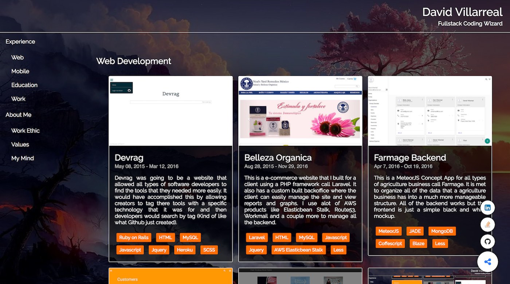
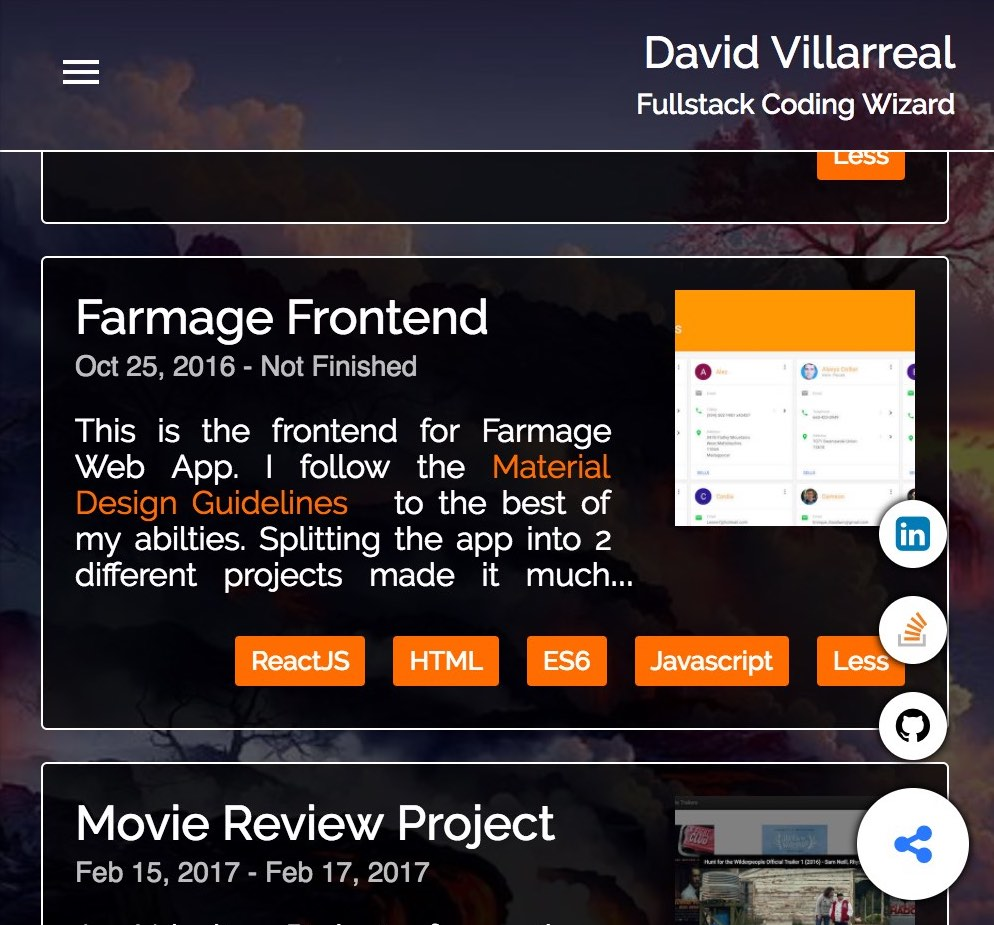

# Portfolio
> Udacity Frontend Nanodegree Project 3

This is the Portfolio Project that I made for my Udacity Frontend and Fullstack Nanodegree. I was given a PDF mockup, and I had to translate that mockup into HTML. I was allowed to add more styles and HTML to the mockup to make it standout more. It is mostly focused on responsive design using things like Flexbox and responsive images.

| Desktop | Mobile |
| ------- | ------ |
|  |  |


## Development
This was the first time I decided to use webpack as the bundler, so I didn't know much about it back then. That begin said I use gulp to optimize the images and then it runs webpack to bundle the Javascript. It also has a simple handlerbars template for all the project cards. The data that gets rendered can be found [here](src/js/data.js), if you want to modify it.

### Get Started
To get the development site up and running go to the project's root directory and run these commands in the terminal.

```ssh
$ npm install
$ gulp build
```

Note that when running the `$ gulp build` it will call webpack and currently the webpack.watch option is set to true in [webpack.config.js](webpack.config.js), if you want to exit out of webpack in the terminal just press `ctrl c` on mac

If you want to view my finished Portfolio just open [build/index.html](build/index.html) in your default browser.

## Dependencies
* [NodeJS 6.10](https://nodejs.org/)
* [NPM 3.10](https://www.npmjs.com/)
